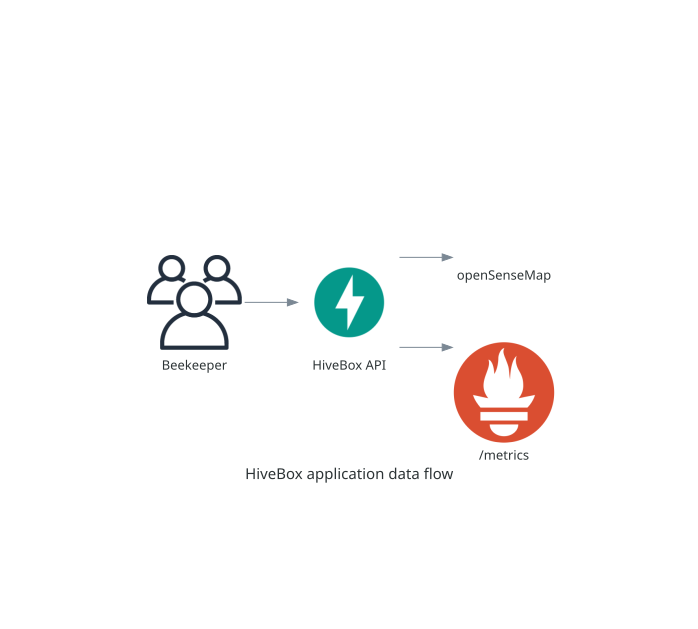

# Application and local container workflow

## Purpose

This guide introduces the HiveBox FastAPI application, its public configuration,
and its local container workflow.



## Concepts

HiveBox obtains ambient-temperature measurements from configured openSenseMap
senseBoxes, averages only the last hour of valid data, and serves the result to
beekeepers. The application object is `src.main:app`; `pyproject.toml` declares
the Python dependencies and FastAPI entrypoint.

## Prerequisites and local start

Python 3.13 is required. Create a virtual environment and start the server:

```shell
python3 -m venv .venv
source .venv/bin/activate
python -m pip install --editable .
fastapi dev
```

The server listens on `http://127.0.0.1:8000`. FastAPI serves generated API
documentation at `/docs` and OpenAPI at `/openapi.json`.

## Use the API

```shell
curl http://127.0.0.1:8000/version
curl http://127.0.0.1:8000/temperature
```

`GET /version` returns `{"version":"0.1.0"}`. `GET /temperature` returns an
average rounded to two decimals, its unit, and a status: below 10 °C is `Too
Cold`, 10–37 °C inclusive is `Good`, and above 37 °C is `Too Hot`. HiveBox
returns `502` if openSenseMap cannot provide valid data and `503` when no
recent measurement is available.

Set `HIVEBOX_SENSEBOX_IDS` to a comma-separated replacement list:

```shell
HIVEBOX_SENSEBOX_IDS="5eba5fbad46fb8001b799786,5c21ff8f919bf8001adf2488" fastapi dev
cp .env.example .env
uvicorn src.main:app --reload --env-file .env
```

`fastapi dev` reads variables exported by the shell; use Uvicorn to load `.env`
directly. Each ID must be exactly 24 hexadecimal characters. Spaces are
trimmed, but empty entries and duplicates are rejected. An absent variable uses
the documented defaults; a supplied invalid value stops startup rather than
silently falling back. Never commit `.env`.

## Run with Docker

```shell
docker build --check .
docker build --tag hivebox:v0.1.0 .
docker run --rm --publish 8000:8000 hivebox:v0.1.0
curl http://127.0.0.1:8000/version
docker run --rm --entrypoint id hivebox:v0.1.0
```

The image runs as a non-root user. Pass alternate senseBoxes with `--env
HIVEBOX_SENSEBOX_IDS=...`. Kubernetes uses the same image tag convention; see
the [Kubernetes guide](kubernetes.md) after the local image works.

## Verification and troubleshooting

Confirm `/version` before testing `/temperature`; the latter needs live
openSenseMap data. A configuration failure is intentional: correct the
supplied value instead of removing it and relying on defaults.

Next: [quality and testing](quality-and-testing.md) and
[observability](observability.md).

## Complete operational reference

### Phase 3: FastAPI application setup

The API is implemented with FastAPI. Its application object lives in
`src/main.py`, and `pyproject.toml` declares both the Python dependencies
and the FastAPI entrypoint.

Python 3.13 is required.

Create and activate a virtual environment:

```shell
python3 -m venv .venv
source .venv/bin/activate
```

Install the project and its dependencies:

```shell
python -m pip install --editable .
```

Start the development server:

```shell
fastapi dev
```

The server listens on `http://127.0.0.1:8000`. FastAPI's generated API
documentation is available at `http://127.0.0.1:8000/docs`, and its OpenAPI
schema is available at `http://127.0.0.1:8000/openapi.json`.

#### Get the deployed version

Request the currently deployed application version:

```shell
curl http://127.0.0.1:8000/version
```

The parameterless `GET /version` endpoint returns:

```json
{"version":"0.1.0"}
```

#### Get the current average temperature

By default, the application retrieves the ambient temperature from these three
senseBoxes and averages measurements from the last hour:

- `5eba5fbad46fb8001b799786`
- `5c21ff8f919bf8001adf2488`
- `5ade1acf223bd80019a1011c`

Request the current average temperature:

```shell
curl http://127.0.0.1:8000/temperature
```

The parameterless `GET /temperature` endpoint returns the average rounded to
two decimal places and its temperature status:

```json
{"average_temperature":15.1,"unit":"°C","status":"Good"}
```

The status uses continuous boundaries, so every temperature has exactly one
classification:

| Average temperature | Status |
| --- | --- |
| Below 10 °C | `Too Cold` |
| From 10 °C through 37 °C | `Good` |
| Above 37 °C | `Too Hot` |

Only ambient temperature measurements no older than one hour are included. The
endpoint returns `502 Bad Gateway` when openSenseMap cannot provide valid data,
and `503 Service Unavailable` when no recent measurement is available.

##### Configure the senseBoxes

Set `HIVEBOX_SENSEBOX_IDS` to a comma-separated list to replace the local
defaults. For example, start the development server with two senseBoxes:

```shell
HIVEBOX_SENSEBOX_IDS="5eba5fbad46fb8001b799786,5c21ff8f919bf8001adf2488" fastapi dev
```

For repeated local use, copy the tracked example to an ignored `.env` file and
edit the IDs:

```shell
cp .env.example .env
```

Uvicorn can load that file before importing HiveBox:

```shell
uvicorn src.main:app --reload --env-file .env
```

`fastapi dev` uses variables already exported by the shell; use the Uvicorn
command above when configuration should come directly from a `.env` file. Do
not commit `.env`. The tracked `.env.example` contains only public sample
configuration.

Each senseBox ID must contain exactly 24 hexadecimal characters. Surrounding
spaces are removed, while empty entries and duplicate IDs are rejected. An
absent variable selects the three defaults above; a variable that is present
but empty or malformed stops the application at startup with a configuration
error. This distinction prevents a deployment mistake from silently querying
the development senseBoxes.

