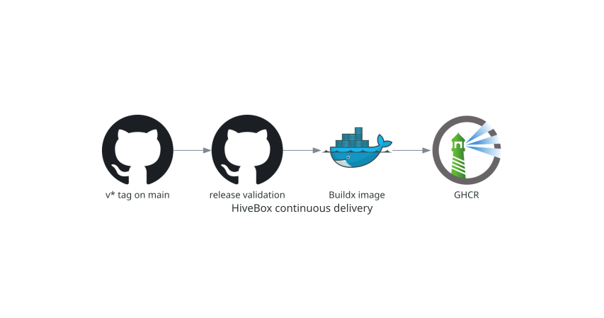

# Continuous delivery

## Purpose

Continuous delivery publishes a release image to GitHub Container Registry only
when a version tag identifies the current `main` commit.

## Release flow

The `Continuous delivery` workflow runs on pushed `v*` tags. It checks out the
tag, fetches `main`, verifies that the tag is exactly `v` plus the version in
`pyproject.toml`, and verifies that the tag commit equals current `main` HEAD.
Only then does Buildx authenticate to GHCR and publish
`ghcr.io/<owner>/<repository>:vX.Y.Z`.

The workflow has no default permissions. Its sole job receives `contents: read`
and `packages: write`; GitHub's ephemeral `GITHUB_TOKEN` performs registry
authentication. The job summary reports the published image digest.

## Verification and troubleshooting

Create the tag only after the production merge, then inspect the Actions
summary and pull the exact tag or digest. A tag/version mismatch or a tag that
does not point to `main` is rejected before publication. Correct the release
lifecycle rather than weakening these checks.

Next: [Kubernetes](kubernetes.md).
