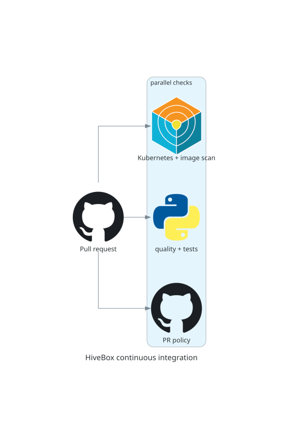

# Continuous integration and security

## Purpose

Continuous integration runs for pull requests and pushes to `develop` and
`main`. Independent checks run in parallel and protect the canonical Gitflow
lifecycle, code quality, packaging, containers, and Kubernetes manifests.



## Checks

The stable Phase 4 checks are `pull-request-policy`, `workflow-lint`,
`python-quality`, `unit-tests`, `integration-tests`, `kubernetes-security`,
`container`, and `sonarqube-quality-gate`. The additional
`documentation-diagrams` job verifies reproducible diagram assets. Together,
they enforce branch direction, Conventional Commit titles, pinned GitHub
Actions, static analysis, coverage, deterministic HTTP tests, manifest scanning,
Docker checks, image scanning, and documentation integrity.

Workflows deny permissions by default. Jobs use only the permissions they need,
have timeouts, and cancel obsolete runs. Protected integrations use merge
commits with no bypass actor; consult repository rulesets with `gh api` when
investigating a protection failure.

## SonarQube Cloud

The dedicated SonarQube Cloud workflow analyses pull requests and permanent
branches, creates `coverage.xml`, and waits for the Quality Gate. Configure
`SONAR_ORGANIZATION` and `SONAR_PROJECT_KEY` as repository variables and
`SONAR_TOKEN` as a secret. External-fork workflows intentionally cannot access
the token; a maintainer must copy a reviewed contribution into the repository
before this required check can pass.

## Supply-chain analysis

OpenSSF Scorecard runs after pushes to `main` and weekly. It publishes SARIF to
Code Scanning and the public Scorecard service, complementing rather than
replacing tests and vulnerability scans.

## Verification and troubleshooting

Use the Actions run and its named job to isolate a failure. Treat a failing
Quality Gate or security hotspot as actionable until reviewed and documented;
never print tokens in logs or store them in the repository.

Next: [continuous delivery](cd.md).

## Complete operational reference

#### Continuous integration

The continuous integration and SonarQube Cloud workflows run for pull requests
and subsequent pushes to `develop` and `main`. Independent jobs start in
parallel and declare no artificial `needs` dependencies. Sequential steps
remain together only when a later step consumes an earlier step's output, such
as scanning and exercising a newly built container image. The checks enforce:

- Gitflow branch direction, release backmerge ordering and Conventional Commits
  pull request titles
- GitHub Actions syntax
- Python linting, formatting, strict static typing and package integrity
- unit tests and the coverage threshold
- deterministic integration tests over HTTP
- Kubernetes manifest security scanning
- Dockerfile linting, image building, non-root metadata and a live `/version`
  smoke test with graceful shutdown, plus container vulnerability scanning
- the SonarQube Cloud Quality Gate

The stable Phase 4 status-check names are:

```text
pull-request-policy
workflow-lint
python-quality
unit-tests
integration-tests
kubernetes-security
container
sonarqube-quality-gate
```

The `main-protection`, `develop-protection`, and `release-protection` rulesets
require the eight stable Phase 4 checks above and accept each result only from
the GitHub Actions App. `develop` and active releases require up-to-date pull
requests. `main` uses loose required checks because canonical Gitflow does not
make a previous release's main merge commit an ancestor of the next release
cut from `develop`.

All protected integrations use merge commits, require pull requests, block
non-fast-forward updates, and have no bypass actor. `main` and `develop` also
block deletion. Release refs remain deletable only so the trusted lifecycle
cleanup can remove them after their final integration.

The `pull-request-policy` check uses read-only API access to validate canonical
branch direction, active-release routing, approved-head ancestry, and companion
backmerge PRs. A previous production integration must complete its second merge
before another release or hotfix can enter `main`.

Repository-wide automatic branch deletion is disabled. The separate cleanup
workflow runs trusted code from the protected default branch and deletes only
same-repository temporary refs whose current SHA still matches the fully merged
lifecycle.

The separate `release-tags` ruleset applies to tags matching `v*`. It prevents
an existing release tag from being deleted or force-updated and has no bypass
actor. It deliberately does not restrict tag creation, so an authorized
maintainer can still create the next release tag after completing the Gitflow
release process.

Inspect the repository rulesets and then retrieve either complete configuration
by its reported identifier:

```shell
gh api repos/MarcPerezdeTudela/devops-hands-on-project-hivebox/rulesets \
  --jq '.[] | [.id, .name, .target, .enforcement] | @tsv'
gh api \
  repos/MarcPerezdeTudela/devops-hands-on-project-hivebox/rulesets/RULESET_ID
```

The CI workflow denies permissions by default. Only jobs that check out source
code receive `contents: read`; the pull request policy job uses event context
without repository access. Every job has a timeout, and concurrency groups
cancel obsolete runs for the same pull request or branch. External GitHub
Actions and containerized linters are pinned to immutable commits or image
digests.

#### Application security and quality analysis

[SonarQube Cloud](https://sonarcloud.io/project/overview?id=MarcPerezdeTudela_devops-hands-on-project-hivebox)
analyzes HiveBox for security, reliability and maintainability issues. The
project uses CI-based analysis on SonarQube Cloud's OSS plan because Gitflow
pull requests normally target `develop`; the plan must therefore support
analysis of multiple branches and pull requests. This hosted setup avoids
maintaining a reachable SonarQube Server and a trusted self-hosted runner.

The dedicated workflow runs for pull requests and subsequent pushes to both
`develop` and `main`. Push analysis keeps the protected target branches current
so pull-request findings are calculated against the correct baseline. The
workflow reruns the unit tests to generate `coverage.xml`, then the official
scanner waits for the SonarQube Quality Gate. A failed gate makes the clearly
named `sonarqube-quality-gate` job fail.

The scanner is sufficient for SonarQube Cloud: setting
`sonar.qualitygate.wait=true` enforces the gate in the same job, while the
GitHub integration also decorates the pull request. A separate Quality Gate
Action would duplicate that polling step. Static-analysis scope and coverage
are configured in `sonar-project.properties`; account identifiers are kept in
GitHub repository variables.

The main-code scope is intentionally limited to the Python application in
`src`, with `tests` classified separately as test code. Workflow syntax and
supply-chain practices already have actionlint and OpenSSF Scorecard checks;
container and dependency security receive their own phase 4 controls. Keeping
those responsibilities separate avoids duplicate findings with different
lifecycles.

Provision the integration before running the workflow:

1. Import this public GitHub repository into a SonarQube Cloud organization
   using the OSS plan and select CI-based analysis.
2. Keep the built-in `Sonar way` quality gate initially and disable automatic
   analysis to prevent duplicate results.
3. Before its first analysis, set the project's long-lived branch pattern to
   `develop`. SonarQube always treats `main` as long-lived; this additional
   pattern models Gitflow's permanent integration branch.
4. Add `SONAR_ORGANIZATION` and `SONAR_PROJECT_KEY` as GitHub Actions repository
   variables using the values shown by SonarQube Cloud.
5. Generate a SonarQube analysis token and add it as the GitHub Actions secret
   `SONAR_TOKEN`. Never store or print the token in the repository.
6. Run the workflow for `develop` and `main` to establish their baselines, then
   verify the analysis on a pull request.

The GitHub CLI can configure the repository values without putting the token in
shell history. The final command prompts for the secret value:

```shell
gh variable set SONAR_ORGANIZATION --body "marcperezdetudela"
gh variable set SONAR_PROJECT_KEY \
  --body "MarcPerezdeTudela_devops-hands-on-project-hivebox"
gh secret set SONAR_TOKEN
```

When the Quality Gate fails, open the linked SonarQube analysis and inspect the
failed conditions and their new-code findings. Fix actionable findings in the
same pull request and rerun the workflow. Mark an issue as accepted or false
positive only after verifying that it does not represent a real risk, and
record a concise justification in SonarQube so the decision remains auditable.
Security hotspots require explicit review even when no code change is needed.

GitHub withholds repository secrets from workflows created by external forks.
The workflow deliberately avoids `pull_request_target`, which would expose the
analysis token while running untrusted code. A maintainer must copy a reviewed
external contribution to a branch in this repository before its required
SonarQube check can pass.

After the initial analyses succeed, issue #30 can make
`sonarqube-quality-gate` a required check on protected branches. That ruleset
change is intentionally separate from this integration.

#### Supply-chain security analysis

OpenSSF Scorecard evaluates the repository's software supply-chain security
practices. It checks repository configuration and development practices such as
workflow permissions, pinned dependencies, branch protection, security policy,
code review and vulnerability handling. It complements the application checks
in continuous integration; it does not replace tests, linters or vulnerability
scanners.

The Scorecard workflow runs after pushes to `main` and every Saturday at
01:30 UTC. Feature branches target `develop`, so their pull requests do not run
this repository-level analysis. The first canonical result for a change appears
after a release branch is merged into `main`.

Each run publishes its SARIF results to GitHub Code Scanning and to the public
OpenSSF Scorecard service. The same SARIF file is available as a workflow
artifact for five days. Consult the workflow run in the repository's Actions
tab, its findings under **Security > Code scanning**, or the public
[OpenSSF Scorecard viewer](https://scorecard.dev/viewer/?uri=github.com/MarcPerezdeTudela/devops-hands-on-project-hivebox).
