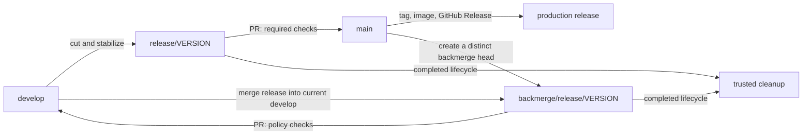

# Gitflow

HiveBox follows canonical Gitflow. `develop` collects work for the next release
and `main` records production releases; protected branches accept merge-commit
pull requests only.

Features and ordinary bug fixes start from `develop`. Releases are stabilized
on `release/VERSION`, integrated into `main`, and backmerged into `develop`.
Hotfixes start from `main` and are backmerged to the active release or develop.

## Release lifecycle

The required order is: merge `release/VERSION → main` first, then create and
merge `backmerge/release/VERSION → develop`. The backmerge must use a distinct
head SHA that contains the release approved on `main`; it cannot reuse the
release PR's check result. After the production merge, the release-publication
workflow creates the annotated version tag, publishes or reuses the versioned
image digest, and creates the GitHub Release.

### Release runbook

1. Start `release/VERSION` from an up-to-date `develop` and make only release
   stabilization changes.
2. Open `release/VERSION → main`. The required checks must be current with
   `main` and pass before the merge commit is permitted.
3. Merge to `main`. Do not create or move the release tag manually unless
   recovering the documented release workflow; the production workflow checks
   that the merge is still the `main` tip before tagging and publishing.
4. From the current `develop`, create `backmerge/release/VERSION`, merge the
   release branch into it, resolve any conflict, and push the branch. Its head
   must differ from the release PR head while containing the `main`-approved
   release commit.
5. Open and merge `backmerge/release/VERSION → develop`. The policy rejects a
   backmerge before the release reaches `main`, an identical companion head,
   and an incomplete hotfix backmerge.
6. Let the cleanup workflow remove the completed release and backmerge refs
   only after it proves their SHAs and lifecycle state.

For a hotfix, start `hotfix/VERSION` from `main`. Merge it to `main` first,
then backmerge it to the one active release, if any, or to `develop`.

## Required checks and manual controls

GitHub performs protected merges with merge commits only. `main` requires the
current results of `pull-request-policy`, `workflow-lint`, `python-quality`,
`unit-tests`, `integration-tests`, `kubernetes-security`, `container`, and
`sonarqube-quality-gate`.

Maintainers retain these deliberate controls: create release and backmerge
branches, open their pull requests, resolve conflicts, merge only after the
required checks pass, and handle documented release recovery. Automation never
approves or merges pull requests, force-pushes, rewrites refs, or replaces a
version tag.

## Protected production merges

The `main-protection` ruleset requires all configured status checks to be
current before a pull request can merge. When `main` advances, GitHub requires
the pull request branch to update and the required checks to pass again on the
updated head; checks from an earlier base state cannot satisfy the rule.

## Temporary branch cleanup

GitHub's repository-wide automatic pull-request branch deletion is disabled.
HiveBox instead runs a repository-owned cleanup workflow after merged pull
requests. It never approves or merges pull requests, creates commits or tags,
rewrites refs, or recreates deleted branches.

The cleanup workflow acts only on same-repository temporary branches and only
when the branch still points to the SHA it validated. A feature or bugfix is
retained until that SHA is an ancestor of `main`; release and hotfix branches
are retained until their required second integration completes. A branch that
moved, belongs to a fork, has an unknown name, or cannot be proved safe is
retained and reported instead of deleted.

- A `feature/*` or `bugfix/*` branch remains after its pull request to
  `develop` (or an active `release/*`) merges. The cleanup workflow deletes it
  only after the exact head SHA of its latest merged pull request is an
  ancestor of `main`; delivery through a release is therefore identified by
  ancestry, not by a branch name or a tag.
- A `release/*` branch remains at its merged head until the required
  `backmerge/release/*` pull request has merged into `develop`, including any
  required hotfix backmerges. A `hotfix/*` branch remains until its required
  backmerge reaches its active release or `develop`.
- A moved, unknown, fork-owned, or still-required branch is retained. The
  workflow logs the reason and fails closed when it cannot prove the required
  relationship. Retrying a completed cleanup is safe: an already-absent ref is
  reported as a no-op.

For manual cleanup, first verify the source SHA is reachable from `main` and
that all required backmerge pull requests are merged. Then delete only the
named temporary branch in GitHub or with `git push origin --delete BRANCH`.
Do not delete `main`, `develop`, an active release, or a ref whose SHA changed
after its approved pull request; resolve the lifecycle state first.
