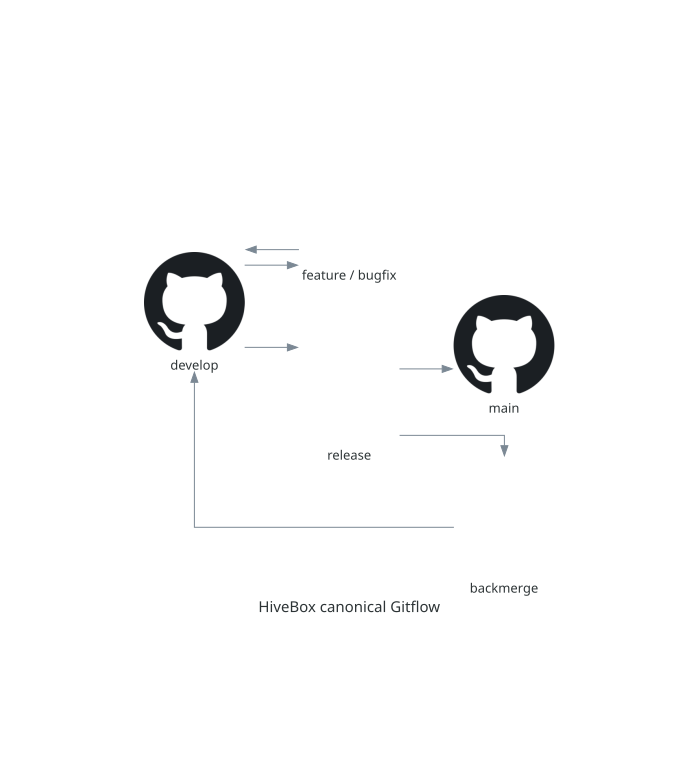

# Canonical Gitflow

## Purpose

HiveBox uses canonical Gitflow: `main` records production releases and
`develop` integrates the next release. Protected branches accept merge-commit
pull requests only; never push directly to them or use squash/rebase merges.



## Prepare Gitflow

```shell
brew install git-flow-next
git flow config sync
git flow config status
```

The CLI creates, publishes, tracks, and removes temporary branches. GitHub
performs protected integrations. Do not use `git flow ... finish`.

## Features and bugfixes

```shell
git switch develop
git pull --ff-only
git flow feature start 47-example
# Commit the implementation.
git flow feature publish 47-example
```

Open `feature/47-example -> develop` and merge with a merge commit. After
GitHub removes the remote branch, delete the local branch with `git flow feature
delete 47-example --no-remote`. Use `git flow bugfix start NAME` for an ordinary
fix, or explicitly start it from `release/VERSION` during stabilization.

## Releases, backmerges, and hotfixes

```shell
git switch develop
git pull --ff-only
git flow release start VERSION
git flow release publish VERSION
make release-prepare
```

Apply only release fixes, documentation, and version preparation on a release.
Create `backmerge/release/VERSION` from current `develop`, merge the release
into it with `--no-ff`, then open the release-to-`main` and backmerge-to-
`develop` pull requests. Merge production first, tag its merge commit, then
complete the backmerge. `make release-prepare` calculates the semantic version,
starts a local release branch, updates versioned files, and runs checks; it
never commits, pushes, merges, tags, or opens a pull request.

Hotfixes start from `main`:

```shell
git switch main
git pull --ff-only
git flow hotfix start VERSION
git flow hotfix publish VERSION
```

Backmerge a hotfix to the active release when one exists, otherwise to
`develop`. A release cannot complete while a production hotfix remains pending.

## One-time history reconciliation

Release `v0.1.0` was independently squash-merged into `main` and `develop`.
Before publishing the next release only, verify `main` still equals that tag and
join its ancestry with an `ours` merge. Stop if the precondition fails; a later
main-only hotfix must be verified as present, not discarded. This exception ends
once the next release reaches both permanent branches.

## Verification

Before a release bump, run `make release-plan`, `make release-check`,
`git diff --check`, and inspect the diff. Next: [continuous delivery](cd.md).

## Complete operational reference

### Canonical Gitflow

This repository follows the canonical
[Gitflow workflow](https://www.atlassian.com/git/tutorials/comparing-workflows/gitflow-workflow).
`main` records production releases and `develop` integrates work for the next
release. Pull requests use merge commits (`--no-ff`); squash and rebase merges
are disabled.

Install `git-flow-next` and synchronize the committed configuration after
cloning:

```shell
brew install git-flow-next
git flow config sync
git flow config status
```

The CLI creates, publishes, tracks, and removes temporary branches. GitHub
performs the final merges because `main`, `develop`, and active release branches
are protected. Do not use `git flow ... finish` to bypass their pull requests.

#### Features and bugfixes

Feature and ordinary bugfix branches start from `develop` and return only to
`develop`:

```shell
git switch develop
git pull --ff-only
git flow feature start 47-example
# Commit the implementation.
git flow feature publish 47-example
```

Open `feature/47-example -> develop` and merge it with a merge commit. After
GitHub removes the remote branch, clean up locally:

```shell
git switch develop
git pull --ff-only
git flow feature delete 47-example --no-remote
```

Use `git flow bugfix start NAME` for a bugfix based on `develop`. During release
stabilization, explicitly use the active release as its base:

```shell
git flow bugfix start NAME release/VERSION
```

#### Releases

Create a release from `develop` and publish it:

```shell
git switch develop
git pull --ff-only
git flow release start VERSION
# Apply only release fixes, documentation, and version preparation.
git flow release publish VERSION
```

Create a conflict-capable backmerge branch from current `develop`. This branch
keeps the release head immutable after production approval while allowing later
`develop` changes and conflict resolutions:

```shell
git switch develop
git pull --ff-only
git switch -c backmerge/release/VERSION
git merge --no-ff release/VERSION \
  -m "chore(release): prepare VERSION backmerge"
git push -u origin backmerge/release/VERSION
```

Open both pull requests before releasing:

1. `release/VERSION -> main`
2. Draft `backmerge/release/VERSION -> develop`

Merge the `main` pull request first. Tag its merge commit, then rerun and merge
the `develop` backmerge:

```shell
git switch main
git pull --ff-only
git tag -a vVERSION -m "HiveBox vVERSION"
git push origin vVERSION
```

Pushing the `vVERSION` tag starts the continuous-delivery workflow. Before it
can publish, the workflow checks that the tag exactly matches the version in
`pyproject.toml` and that the tag points to the current `main` commit. It then
publishes the immutable versioned image
`ghcr.io/MarcPerezdeTudela/devops-hands-on-project-hivebox:vVERSION` to GitHub
Container Registry. The workflow summary and logs record the resulting image
digest. Pull requests and ordinary branch pushes never publish release images.

#### Controlled release preparation

Install the local release tools once before preparing a release or hotfix:

```shell
python -m pip install --editable ".[quality,test]"
```

After `git flow release start VERSION` or `git flow hotfix start VERSION`, use
the Make target that matches the intended semantic-version increment. The
target calculates the next version, verifies that the working tree is clean,
and requires the current `release/VERSION` or `hotfix/VERSION` branch to match
that calculated version.

```shell
make release-bump-patch
# or: make release-bump-minor
# or: make release-bump-major
make release-check
git diff --check
git diff
```

For an ordinary release, `make release-plan` derives the next version from the
Conventional Commit subjects since the latest reachable `vX.Y.Z` tag: `fix:`
and `perf:` produce a patch release, `feat:` produces a minor release, and a
`!` marker or `BREAKING CHANGE:` footer produces a major release. Use
`make release-prepare` from a clean `develop` branch to calculate that version,
start the local Gitflow release branch, apply the bump, and run `release-check`
in one command. It stops before any commit, push, pull request, merge, tag, or
GitHub Release.

Until the one-time `v0.1.0` history reconciliation described below is completed,
the calculation uses its documented backmerge on `develop` as the release
baseline. The reconciliation merge itself remains an explicit manual Gitflow
step; `make release-prepare` never creates it.

The bump updates the authoritative project version, the local Kubernetes image
reference, version-contract tests, and active README examples. It does not
commit, tag, push, open a pull request, merge a branch, or create a GitHub
Release. Review the diff and commit the version change explicitly before
continuing with the existing Gitflow pull-request, merge, backmerge, and manual
tagging sequence above. `release-check` refreshes the editable installation so
the version-endpoint tests exercise the bumped package metadata.

The cleanup workflow deletes both remote temporary branches only after the
backmerge completes.

#### Hotfixes

Hotfixes are the only work that starts from `main`:

```shell
git switch main
git pull --ff-only
git flow hotfix start VERSION
# Commit and validate the production fix.
git flow hotfix publish VERSION
```

If a release is active, create `backmerge/hotfix/VERSION` from that release;
otherwise create it from `develop`. Merge `hotfix/VERSION` into the backmerge
branch and publish it. Open `hotfix/VERSION -> main` plus the backmerge PR to
the selected target. Merge into `main` first and tag its merge commit. A release
cannot complete while one of its production hotfixes is still pending.

#### One-time history reconciliation

Release `v0.1.0` was independently squash-merged into `main` and `develop`.
Before publishing the next release only, join that ancestry without changing
the release tree:

```shell
test "$(git rev-parse main)" = "$(git rev-list -n 1 v0.1.0)"
release_tree=$(git rev-parse 'HEAD^{tree}')
git merge --no-ff -s ours main \
  -m "chore(gitflow): reconcile pre-canonical release history"
test "$(git rev-parse 'HEAD^{tree}')" = "${release_tree}"
```

Stop if the `main == v0.1.0` precondition fails. A later main-only hotfix must
be verified as present instead of being discarded by the `ours` strategy. This
exception is unnecessary after the next release reaches both permanent branches.

