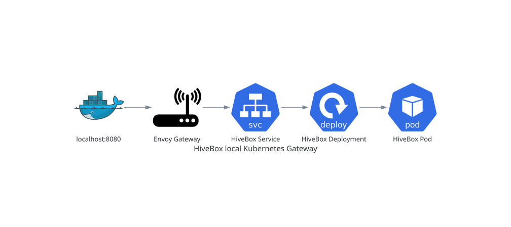

# Local Kubernetes Gateway

## Purpose

HiveBox uses KIND to run Kubernetes in Docker and Envoy Gateway to implement
the Gateway API. The workload is deployed separately from its container image
and is reached through the local Envoy proxy.



## Concepts and prerequisites

The request path is `127.0.0.1:8080` → KIND node port `30080` → Envoy proxy →
HiveBox Service → HiveBox Pod. `GatewayClass`, `Gateway`, `EnvoyProxy`,
`HTTPRoute`, Service, ConfigMap, Namespace, and Deployment have distinct
responsibilities; an HTTPRoute is controller configuration, not a process that
handles packets.

Install Docker, KIND, kubectl, and Helm. Confirm Docker is available with
`docker version` and `docker info`. Use the pinned Kubernetes and Envoy Gateway
versions documented in the manifests; do not substitute floating tags.

## Create, deploy, and verify

Create the KIND cluster from `kubernetes/kind/cluster.yaml`, install Envoy
Gateway, then apply the gateway manifests. Build the documented local image,
load it into the KIND node, and apply `kubernetes/app/`. The Deployment uses
`imagePullPolicy: Never`, so the exact image tag must already be loaded.

```shell
docker build --tag hivebox:v0.1.0 .
kind load docker-image hivebox:v0.1.0 --name hivebox
kubectl apply --server-side --dry-run=server -f kubernetes/app
kubectl apply -f kubernetes/app
kubectl rollout status deployment/hivebox --namespace hivebox
curl http://127.0.0.1:8080/version
curl http://127.0.0.1:8080/metrics
```

Verify the Gateway is `Programmed`, the HTTPRoute is accepted and resolves its
references, the Deployment is available, the Pod is Ready without restarts, and
the Service has EndpointSlice addresses. A successful `/version` proves the
routing path; `/temperature` can still return the documented openSenseMap 502
or 503 after routing succeeds.

## Troubleshooting and cleanup

Inspect desired state, observed state, events, and logs in that order:

```shell
kubectl --namespace hivebox describe deployment/hivebox
kubectl --namespace hivebox get pods,services,endpointslices,httproutes --output wide
kubectl --namespace hivebox logs deployment/hivebox
kubectl --namespace hivebox get events --sort-by=.lastTimestamp
```

`ErrImageNeverPull` means the KIND node lacks the manifest tag; missing
EndpointSlice addresses indicate labels or Pod readiness; `ResolvedRefs=False`
indicates an invalid backend; and `Accepted=False` indicates a listener or
attachment problem. Delete only the named cluster and the temporary kubeconfig
and Envoy installation files created for this lifecycle.

Next: return to [observability](observability.md) or [Gitflow](gitflow.md).

## Complete operational reference

### Phase 4: Local Kubernetes gateway

HiveBox uses [KIND](https://kind.sigs.k8s.io/) to run a local Kubernetes cluster
on Docker. KIND means **Kubernetes IN Docker**: it creates a Docker container
that behaves as a Kubernetes node. It does not put Kubernetes inside the
HiveBox application container. A later step will deploy HiveBox as a separate
pod managed by this cluster.

Incoming HTTP traffic uses the Kubernetes
[Gateway API](https://gateway-api.sigs.k8s.io/). Gateway API is a collection of
Kubernetes resource definitions; it needs a controller that turns those
declarations into running infrastructure. HiveBox uses
[Envoy Gateway](https://gateway.envoyproxy.io/) as that controller and Envoy
Proxy as the process that receives each request.

The resources introduced here have different responsibilities:

- `EnvoyProxy` tells Envoy Gateway how to expose the generated proxy Service;
- `GatewayClass` associates HiveBox Gateways with the Envoy Gateway controller;
- `Gateway` requests an HTTP listener on port 80;
- a future `HTTPRoute` from issue #25 will describe which requests go to the
  HiveBox Service.

`HTTPRoute` is configuration consumed by the controller, not a process through
which network packets travel. Once issue #25 is implemented, the runtime path
will be:

```text
127.0.0.1:8080
  -> KIND node container port 30080
  -> Envoy NodePort Service
  -> Envoy Proxy pod
  -> HiveBox Service
  -> HiveBox pod
```

This phase pins Kubernetes 1.36.4 because it is both available for KIND 0.33.0
and supported by Envoy Gateway 1.9.0. The KIND node image is pinned by digest,
so the cluster does not silently change when a tag is republished. The Envoy
Gateway release manifest is downloaded at runtime and verified with SHA-256
before Kubernetes receives it.

#### Prerequisites

Install and start:

- Docker with a running Docker engine;
- KIND 0.33.0;
- `kubectl` 1.37.0;
- `curl` and `shasum`.

The `kubectl` client may be one minor version newer than the Kubernetes API
server. Check the tools from the repository root:

```shell
docker version
docker info
kind version
kubectl version --client
curl --version
shasum --version
```

Port 8080 must be free. This command should produce no output:

```shell
lsof -nP -iTCP:8080 -sTCP:LISTEN
```

List existing KIND clusters:

```shell
kind get clusters
```

If `hivebox` already exists, inspect or delete it deliberately before creating
a fresh environment. KIND must never replace an existing cluster implicitly.

#### Create the KIND cluster

Create a temporary kubeconfig and keep these variables in the same terminal for
the entire lifecycle:

```shell
HIVEBOX_KUBECONFIG="$(mktemp "${TMPDIR:-/tmp}/hivebox-kubeconfig.XXXXXX")"
export HIVEBOX_KUBECONFIG
```

A kubeconfig contains cluster addresses and credentials used by `kubectl`.
Using a dedicated temporary file prevents KIND from modifying the default
kubeconfig or changing its current context.

Create the single-node cluster:

```shell
kind create cluster \
  --name hivebox \
  --config kubernetes/kind/cluster.yaml \
  --kubeconfig "$HIVEBOX_KUBECONFIG" \
  --wait 120s
```

The KIND configuration maps only `127.0.0.1:8080` on the host to TCP port
`30080` in the node container. Binding to loopback means the gateway is not
exposed to other machines on the local network.

Wait for the node to report that it can accept workloads:

```shell
kubectl \
  --kubeconfig "$HIVEBOX_KUBECONFIG" \
  --context kind-hivebox \
  wait \
  --for=condition=Ready \
  node/hivebox-control-plane \
  --timeout=120s
```

Every Kubernetes command below includes the dedicated kubeconfig and context.
This repetition is intentional: it makes the target cluster unambiguous.

#### Install Envoy Gateway

Download the Envoy Gateway 1.9.0 installer into another temporary location:

```shell
HIVEBOX_ENVOY_DIR="$(mktemp -d "${TMPDIR:-/tmp}/hivebox-envoy.XXXXXX")"
export HIVEBOX_ENVOY_DIR

curl \
  --fail \
  --location \
  --silent \
  --show-error \
  --output "$HIVEBOX_ENVOY_DIR/install.yaml" \
  https://github.com/envoyproxy/gateway/releases/download/v1.9.0/install.yaml
```

Verify the exact release asset. A successful command prints `OK`:

```shell
printf '%s  %s\n' \
  a83dea73466ee6528f0d23f86d36573fbf1f305c822d986a63e262e32594481a \
  "$HIVEBOX_ENVOY_DIR/install.yaml" \
  | shasum -a 256 --check
```

Do not continue if the checksum differs. A mismatch means the downloaded bytes
are not the artifact reviewed for this repository.

Apply the verified manifest with server-side apply. Envoy Gateway's installer
contains large CRDs, for which server-side apply avoids the annotation size
limit of client-side apply:

```shell
kubectl \
  --kubeconfig "$HIVEBOX_KUBECONFIG" \
  --context kind-hivebox \
  apply \
  --server-side \
  --filename "$HIVEBOX_ENVOY_DIR/install.yaml"
```

Wait for the Envoy Gateway control-plane Deployment:

```shell
kubectl \
  --kubeconfig "$HIVEBOX_KUBECONFIG" \
  --context kind-hivebox \
  --namespace envoy-gateway-system \
  wait \
  --for=condition=Available \
  deployment/envoy-gateway \
  --timeout=5m
```

#### Configure the HiveBox gateway

Ask the real API server to validate the three local manifests without saving
them:

```shell
kubectl \
  --kubeconfig "$HIVEBOX_KUBECONFIG" \
  --context kind-hivebox \
  apply \
  --server-side \
  --dry-run=server \
  --filename kubernetes/gateway/
```

Then apply the same directory. File names keep the dependency order visible:
the `EnvoyProxy` configuration comes before the class that references it, and
the class comes before the Gateway.

```shell
kubectl \
  --kubeconfig "$HIVEBOX_KUBECONFIG" \
  --context kind-hivebox \
  apply \
  --server-side \
  --filename kubernetes/gateway/
```

Wait for Envoy Gateway to accept the class and program the listener:

```shell
kubectl \
  --kubeconfig "$HIVEBOX_KUBECONFIG" \
  --context kind-hivebox \
  wait \
  --for=condition=Accepted \
  gatewayclass/hivebox \
  --timeout=5m

kubectl \
  --kubeconfig "$HIVEBOX_KUBECONFIG" \
  --context kind-hivebox \
  --namespace envoy-gateway-system \
  wait \
  --for=condition=Programmed \
  gateway/hivebox \
  --timeout=5m
```

`Accepted` means the controller recognizes and will manage the GatewayClass.
`Programmed` means it has created and configured the Envoy data plane requested
by the Gateway.

#### Verify the gateway

Select the generated Envoy resources through stable ownership labels instead
of relying on their generated names:

```shell
HIVEBOX_ENVOY_SELECTOR='gateway.envoyproxy.io/owning-gateway-namespace=envoy-gateway-system,gateway.envoyproxy.io/owning-gateway-name=hivebox'
export HIVEBOX_ENVOY_SELECTOR

HIVEBOX_ENVOY_DEPLOYMENT="$(kubectl \
  --kubeconfig "$HIVEBOX_KUBECONFIG" \
  --context kind-hivebox \
  --namespace envoy-gateway-system \
  get deployments \
  --selector "$HIVEBOX_ENVOY_SELECTOR" \
  --output jsonpath='{.items[0].metadata.name}')"
export HIVEBOX_ENVOY_DEPLOYMENT

HIVEBOX_ENVOY_SERVICE="$(kubectl \
  --kubeconfig "$HIVEBOX_KUBECONFIG" \
  --context kind-hivebox \
  --namespace envoy-gateway-system \
  get services \
  --selector "$HIVEBOX_ENVOY_SELECTOR" \
  --output jsonpath='{.items[0].metadata.name}')"
export HIVEBOX_ENVOY_SERVICE
```

Both variables must contain a generated name:

```shell
test -n "$HIVEBOX_ENVOY_DEPLOYMENT"
test -n "$HIVEBOX_ENVOY_SERVICE"
printf 'Deployment: %s\nService: %s\n' \
  "$HIVEBOX_ENVOY_DEPLOYMENT" \
  "$HIVEBOX_ENVOY_SERVICE"
```

Wait for the proxy Deployment and inspect the resources:

```shell
kubectl \
  --kubeconfig "$HIVEBOX_KUBECONFIG" \
  --context kind-hivebox \
  --namespace envoy-gateway-system \
  rollout status \
  "deployment/$HIVEBOX_ENVOY_DEPLOYMENT" \
  --timeout=5m

kubectl \
  --kubeconfig "$HIVEBOX_KUBECONFIG" \
  --context kind-hivebox \
  get nodes,gatewayclasses

kubectl \
  --kubeconfig "$HIVEBOX_KUBECONFIG" \
  --context kind-hivebox \
  --namespace envoy-gateway-system \
  get gateways,pods,services
```

Confirm that the generated HTTP Service port is the expected NodePort:

```shell
HIVEBOX_NODE_PORT="$(kubectl \
  --kubeconfig "$HIVEBOX_KUBECONFIG" \
  --context kind-hivebox \
  --namespace envoy-gateway-system \
  get "service/$HIVEBOX_ENVOY_SERVICE" \
  --output jsonpath='{.spec.ports[?(@.port==80)].nodePort}')"

test "$HIVEBOX_NODE_PORT" = 30080

docker port hivebox-control-plane 30080/tcp \
  | grep --fixed-strings '127.0.0.1:8080'
```

No application route belongs to issue #24, so this command must report no
resources:

```shell
kubectl \
  --kubeconfig "$HIVEBOX_KUBECONFIG" \
  --context kind-hivebox \
  get httproutes \
  --all-namespaces
```

Request a unique path from the listener and capture its status:

```shell
HIVEBOX_CHECK_PATH='/issue-24-gateway-check'
export HIVEBOX_CHECK_PATH

HIVEBOX_HTTP_STATUS="$(curl \
  --silent \
  --show-error \
  --max-time 10 \
  --output /dev/null \
  --write-out '%{http_code}' \
  "http://127.0.0.1:8080$HIVEBOX_CHECK_PATH")"

test "$HIVEBOX_HTTP_STATUS" = 404
```

Confirm that Envoy logged that exact path as a missing route:

```shell
kubectl \
  --kubeconfig "$HIVEBOX_KUBECONFIG" \
  --context kind-hivebox \
  --namespace envoy-gateway-system \
  logs \
  "deployment/$HIVEBOX_ENVOY_DEPLOYMENT" \
  --container envoy \
  --tail=20 \
  | grep --fixed-strings '"response_code":404' \
  | grep --fixed-strings '"response_code_details":"route_not_found"' \
  | grep --fixed-strings '"x-envoy-origin-path":"/issue-24-gateway-check"'
```

The 404 plus the matching Envoy access-log entry is the expected success result
for issue #24. It proves the request crossed Docker's port mapping, the
Kubernetes NodePort Service, and the Envoy Proxy listener. Envoy has no
`HTTPRoute` yet, so it correctly has nowhere to forward the request. The next
procedure adds the route and HiveBox workload.

#### Deploy the HiveBox workload

The application uses five plain Kubernetes resources under `kubernetes/app/`:

- the `Namespace` named `hivebox` isolates application resources from the
  Envoy infrastructure;
- the `ConfigMap` supplies the public senseBox IDs as an environment variable;
- the `Deployment` describes the desired HiveBox Pod and keeps one replica
  running;
- the `Service` gives changing Pods one stable in-cluster destination;
- the `HTTPRoute` tells Envoy which Service should receive HTTP requests.

A Deployment is a controller, not the application process itself. It creates a
ReplicaSet, which creates the Pod in which the HiveBox container runs. The
Service finds that Pod by label. `HTTPRoute` is also configuration rather than
a packet hop: Envoy Gateway watches it and programs Envoy Proxy accordingly.
The resulting runtime path is:

```text
127.0.0.1:8080
  -> KIND node container port 30080
  -> Envoy NodePort Service
  -> Envoy Proxy pod
  -> HiveBox ClusterIP Service port 8000
  -> HiveBox pod port 8000
```

##### Build and load the image

Read the authoritative application version from `pyproject.toml` and use the
repository's `v`-prefixed Docker tag convention:

```shell
HIVEBOX_VERSION="$(python3 -c \
  'import pathlib, tomllib; print(tomllib.loads(pathlib.Path("pyproject.toml").read_text())["project"]["version"])')"
HIVEBOX_IMAGE="hivebox:v$HIVEBOX_VERSION"

export HIVEBOX_IMAGE
export HIVEBOX_VERSION

test "$HIVEBOX_IMAGE" = hivebox:v0.1.0
grep --fixed-strings "image: $HIVEBOX_IMAGE" \
  kubernetes/app/deployment.yaml
```

The equality check deliberately catches version drift between
`pyproject.toml` and the static Deployment manifest. Build the image:

```shell
docker build --tag "$HIVEBOX_IMAGE" .
```

Confirm that the image still runs as the unprivileged user created by the
Dockerfile and declares the application port:

```shell
test "$(docker image inspect \
  "$HIVEBOX_IMAGE" \
  --format '{{.Config.User}}')" = '10001:10001'

docker image inspect \
  "$HIVEBOX_IMAGE" \
  --format '{{json .Config.ExposedPorts}}' \
  | grep --fixed-strings '"8000/tcp"'
```

Docker and the container runtime inside the KIND node have separate image
stores. Copy the local image into the named cluster:

```shell
kind load docker-image "$HIVEBOX_IMAGE" --name hivebox
```

Verify that the fresh node can see the exact repository and tag:

```shell
docker exec hivebox-control-plane crictl images \
  | grep --fixed-strings 'docker.io/library/hivebox' \
  | grep --fixed-strings 'v0.1.0'
```

The Deployment uses `imagePullPolicy: Never`. Kubernetes must use this loaded
image and cannot silently fetch a different one from a registry. A tag mismatch
therefore produces `ErrImageNeverPull` instead of running unintended code.

##### Validate and apply the manifests

Create the namespace first because the other four resources belong to it:

```shell
kubectl \
  --kubeconfig "$HIVEBOX_KUBECONFIG" \
  --context kind-hivebox \
  apply \
  --server-side \
  --filename kubernetes/app/namespace.yaml
```

Ask the real API server and installed Gateway API CRDs to validate the complete
directory without persisting changes:

```shell
kubectl \
  --kubeconfig "$HIVEBOX_KUBECONFIG" \
  --context kind-hivebox \
  apply \
  --server-side \
  --dry-run=server \
  --filename kubernetes/app/
```

Apply the validated desired state:

```shell
kubectl \
  --kubeconfig "$HIVEBOX_KUBECONFIG" \
  --context kind-hivebox \
  apply \
  --server-side \
  --filename kubernetes/app/
```

Wait for the Deployment controller and its Pod:

```shell
kubectl \
  --kubeconfig "$HIVEBOX_KUBECONFIG" \
  --context kind-hivebox \
  --namespace hivebox \
  rollout status \
  deployment/hivebox \
  --timeout=5m

kubectl \
  --kubeconfig "$HIVEBOX_KUBECONFIG" \
  --context kind-hivebox \
  --namespace hivebox \
  wait \
  --for=condition=Ready \
  pod \
  --selector app.kubernetes.io/name=hivebox \
  --timeout=5m
```

There is no HTTP readiness probe yet because the dedicated readiness endpoint
belongs to phase 5. The Pod becoming Ready proves that its container is
running; the bounded HTTP checks below separately prove that FastAPI accepts
requests.

##### Verify the workload and route

Inspect the desired workload, live Pod, stable Service, discovered endpoint,
and route together:

```shell
kubectl \
  --kubeconfig "$HIVEBOX_KUBECONFIG" \
  --context kind-hivebox \
  --namespace hivebox \
  get deployments,pods,services,endpointslices,httproutes \
  --output wide
```

Expect one available Deployment, one Ready Pod with no restarts, a ClusterIP
Service on port `8000`, and an EndpointSlice pointing to the Pod on the same
port.

Inspect the security and resource settings that Kubernetes stored:

```shell
kubectl \
  --kubeconfig "$HIVEBOX_KUBECONFIG" \
  --context kind-hivebox \
  --namespace hivebox \
  get deployment/hivebox \
  --output jsonpath='{.spec.template.spec.automountServiceAccountToken}{"\n"}{.spec.template.spec.securityContext}{"\n"}{.spec.template.spec.containers[0].securityContext}{"\n"}{.spec.template.spec.containers[0].resources}{"\n"}'
```

The output must show `false` for token mounting, UID and GID `10001`,
`runAsNonRoot`, seccomp `RuntimeDefault`, a read-only root filesystem, no
privilege escalation, all capabilities dropped, and the declared CPU and
memory request/limit pairs.

An HTTPRoute stores conditions under each parent rather than at the resource's
top level. Capture its JSON and validate the exact Envoy parent and current
generation:

```shell
HIVEBOX_ROUTE_JSON="$(kubectl \
  --kubeconfig "$HIVEBOX_KUBECONFIG" \
  --context kind-hivebox \
  --namespace hivebox \
  get httproute/hivebox \
  --output json)"
export HIVEBOX_ROUTE_JSON

python3 - <<'PY'
import json
import os

route = json.loads(os.environ["HIVEBOX_ROUTE_JSON"])
expected_parent = {
    "group": "gateway.networking.k8s.io",
    "kind": "Gateway",
    "name": "hivebox",
    "namespace": "envoy-gateway-system",
    "sectionName": "http",
}
parents = [
    parent
    for parent in route.get("status", {}).get("parents", [])
    if parent.get("controllerName")
    == "gateway.envoyproxy.io/gatewayclass-controller"
    and parent.get("parentRef") == expected_parent
]
assert len(parents) == 1, parents

generation = route["metadata"]["generation"]
conditions = {
    condition["type"]: condition for condition in parents[0]["conditions"]
}
for condition_type in ("Accepted", "ResolvedRefs"):
    condition = conditions[condition_type]
    assert condition["status"] == "True", condition
    assert condition["observedGeneration"] == generation, condition
    print(f"{condition_type}=True for generation {generation}")
PY
```

`Accepted=True` means the Gateway permits and understands this route.
`ResolvedRefs=True` means its backend Service reference is valid. Comparing
`observedGeneration` prevents an old successful status from validating a newer
manifest.

##### Verify the HTTP endpoints

Retry `/version` for at most roughly 20 seconds while FastAPI starts, then
validate its exact response:

```shell
HIVEBOX_VERSION_BODY="$(curl \
  --fail \
  --silent \
  --show-error \
  --connect-timeout 2 \
  --max-time 5 \
  --retry 20 \
  --retry-all-errors \
  --retry-delay 1 \
  http://127.0.0.1:8080/version)"

test "$HIVEBOX_VERSION_BODY" = "{\"version\":\"$HIVEBOX_VERSION\"}"
```

Request metrics and require representative application, Python, and garbage
collector samples:

```shell
HIVEBOX_METRICS_BODY="$(curl \
  --fail \
  --silent \
  --show-error \
  --connect-timeout 2 \
  --max-time 10 \
  http://127.0.0.1:8080/metrics)"

printf '%s\n' "$HIVEBOX_METRICS_BODY" \
  | grep --fixed-strings 'http_requests_total'
printf '%s\n' "$HIVEBOX_METRICS_BODY" \
  | grep --fixed-strings 'python_info'
printf '%s\n' "$HIVEBOX_METRICS_BODY" \
  | grep --fixed-strings 'python_gc_objects_collected_total'
```

`/temperature` calls the live openSenseMap service. A healthy route can
therefore return a normal `200`, an application `502` for an upstream HTTP
failure, or an application `503` when no fresh measurements exist. Capture its
status, headers, and body separately:

```shell
HIVEBOX_RESPONSE_DIR="$(mktemp -d \
  "${TMPDIR:-/tmp}/hivebox-responses.XXXXXX")"
HIVEBOX_TEMPERATURE_STATUS="$(curl \
  --silent \
  --show-error \
  --connect-timeout 2 \
  --max-time 30 \
  --dump-header "$HIVEBOX_RESPONSE_DIR/temperature.headers" \
  --output "$HIVEBOX_RESPONSE_DIR/temperature.json" \
  --write-out '%{http_code}' \
  http://127.0.0.1:8080/temperature)"

export HIVEBOX_RESPONSE_DIR
export HIVEBOX_TEMPERATURE_STATUS
```

Validate one of the exact HiveBox JSON contracts. This rejects an Envoy error
that happens to use the same HTTP status:

```shell
python3 - <<'PY'
import json
import os
from pathlib import Path

response_dir = Path(os.environ["HIVEBOX_RESPONSE_DIR"])
status = int(os.environ["HIVEBOX_TEMPERATURE_STATUS"])
headers = (response_dir / "temperature.headers").read_text().lower()
body = json.loads((response_dir / "temperature.json").read_text())

assert "content-type: application/json" in headers, headers
if status == 200:
    assert set(body) == {"average_temperature", "unit", "status"}, body
    assert isinstance(body["average_temperature"], (int, float)), body
    assert body["unit"] == "°C", body
    assert body["status"] in {"Too Cold", "Good", "Too Hot"}, body
elif status == 502:
    assert body == {
        "detail": "Failed to retrieve temperature data from openSenseMap"
    }, body
elif status == 503:
    assert body == {
        "detail": (
            "No temperature measurements from the last hour are available"
        )
    }, body
else:
    raise AssertionError((status, body))

print(f"HiveBox /temperature contract accepted with HTTP {status}")
PY
```

Remove only those captured response files after the assertion:

```shell
rm -- "$HIVEBOX_RESPONSE_DIR/temperature.headers"
rm -- "$HIVEBOX_RESPONSE_DIR/temperature.json"
rmdir -- "$HIVEBOX_RESPONSE_DIR"

unset HIVEBOX_RESPONSE_DIR
unset HIVEBOX_TEMPERATURE_STATUS
```

##### Remove and redeploy only HiveBox

Delete the application namespace without touching the Gateway infrastructure:

```shell
kubectl \
  --kubeconfig "$HIVEBOX_KUBECONFIG" \
  --context kind-hivebox \
  delete namespace hivebox \
  --wait=true \
  --timeout=5m
```

Confirm that the Gateway remains programmed:

```shell
kubectl \
  --kubeconfig "$HIVEBOX_KUBECONFIG" \
  --context kind-hivebox \
  --namespace envoy-gateway-system \
  wait \
  --for=condition=Programmed \
  gateway/hivebox \
  --timeout=5m
```

With the route removed, a request again returns Envoy's no-route `404`:

```shell
HIVEBOX_HTTP_STATUS="$(curl \
  --silent \
  --show-error \
  --max-time 10 \
  --output /dev/null \
  --write-out '%{http_code}' \
  http://127.0.0.1:8080/issue-25-removal-check)"

test "$HIVEBOX_HTTP_STATUS" = 404
```

Reapply `namespace.yaml`, repeat the server-side dry run and directory apply,
then repeat the rollout, HTTPRoute, and endpoint checks. That proves scoped
redeployment while retaining the cluster and Envoy resources from issue #24.

##### Troubleshoot the workload

Diagnose from the application inward to the request edge:

```shell
kubectl \
  --kubeconfig "$HIVEBOX_KUBECONFIG" \
  --context kind-hivebox \
  --namespace hivebox \
  describe deployment/hivebox

kubectl \
  --kubeconfig "$HIVEBOX_KUBECONFIG" \
  --context kind-hivebox \
  --namespace hivebox \
  get pods,services,endpointslices,httproutes \
  --output wide

kubectl \
  --kubeconfig "$HIVEBOX_KUBECONFIG" \
  --context kind-hivebox \
  --namespace hivebox \
  logs deployment/hivebox

kubectl \
  --kubeconfig "$HIVEBOX_KUBECONFIG" \
  --context kind-hivebox \
  --namespace hivebox \
  get events \
  --sort-by=.lastTimestamp

kubectl \
  --kubeconfig "$HIVEBOX_KUBECONFIG" \
  --context kind-hivebox \
  --namespace hivebox \
  describe httproute/hivebox
```

- `ErrImageNeverPull` means the manifest tag is not present in the KIND node;
- a failing or restarting Pod requires its events and application logs;
- a Service without an EndpointSlice address indicates a label or Pod problem;
- `ResolvedRefs=False` identifies an invalid backend reference;
- `Accepted=False` identifies an attachment or listener problem;
- an exact HiveBox JSON `502` or `503` from `/temperature` indicates an
  openSenseMap problem after routing succeeded.

#### Troubleshoot the environment

If a wait or request fails, inspect desired state, observed state, events, and
logs in that order:

```shell
kubectl \
  --kubeconfig "$HIVEBOX_KUBECONFIG" \
  --context kind-hivebox \
  describe gatewayclass/hivebox

kubectl \
  --kubeconfig "$HIVEBOX_KUBECONFIG" \
  --context kind-hivebox \
  --namespace envoy-gateway-system \
  describe gateway/hivebox

kubectl \
  --kubeconfig "$HIVEBOX_KUBECONFIG" \
  --context kind-hivebox \
  --namespace envoy-gateway-system \
  get events \
  --sort-by=.lastTimestamp

kubectl \
  --kubeconfig "$HIVEBOX_KUBECONFIG" \
  --context kind-hivebox \
  --namespace envoy-gateway-system \
  logs \
  deployment/envoy-gateway
```

Also check `docker info`, `kind get clusters`, the port-8080 listener, the
generated Service's NodePort, and the Envoy proxy pod status. A checksum failure
is not a Kubernetes problem: stop before installation and verify the upstream
release asset.

#### Delete and rebuild the environment

Delete only the named KIND cluster, still using its dedicated kubeconfig:

```shell
kind delete cluster \
  --name hivebox \
  --kubeconfig "$HIVEBOX_KUBECONFIG"
```

Remove only the temporary files created during this lifecycle:

```shell
rm -- "$HIVEBOX_ENVOY_DIR/install.yaml"
rmdir -- "$HIVEBOX_ENVOY_DIR"
rm -- "$HIVEBOX_KUBECONFIG"

unset HIVEBOX_CHECK_PATH
unset HIVEBOX_ENVOY_DEPLOYMENT
unset HIVEBOX_ENVOY_DIR
unset HIVEBOX_ENVOY_SELECTOR
unset HIVEBOX_ENVOY_SERVICE
unset HIVEBOX_HTTP_STATUS
unset HIVEBOX_IMAGE
unset HIVEBOX_KUBECONFIG
unset HIVEBOX_METRICS_BODY
unset HIVEBOX_NODE_PORT
unset HIVEBOX_ROUTE_JSON
unset HIVEBOX_VERSION
unset HIVEBOX_VERSION_BODY
```

Run the complete create, install, configure, image build and load, application
deployment, verification, and delete procedure again with newly generated
temporary paths. A second successful clean lifecycle demonstrates that the
environment is reproducible rather than dependent on a retained KIND image or
leftover cluster state.

