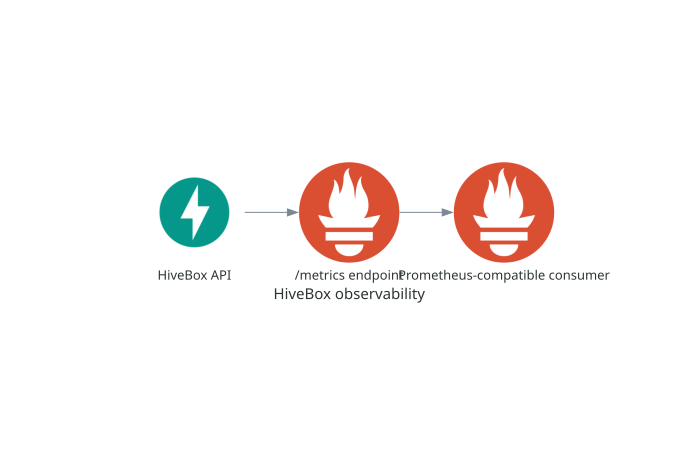

# Observability

## Purpose

HiveBox exposes Prometheus-compatible runtime metrics so operators can inspect
the service without adding business-specific telemetry prematurely.



## Inspect metrics

```shell
curl http://127.0.0.1:8000/metrics
```

The endpoint returns Prometheus text metrics, including HTTP instrumentation,
`python_info`, `python_gc_*`, and, on supported Linux runtimes, `process_*`
CPU, memory, and start-time metrics. Docker runs on Linux and exposes all
three groups; direct local runs can omit runtime-dependent process metrics.

## Current boundary

`/metrics` is operational and is deliberately omitted from FastAPI's generated
OpenAPI schema. Phase 4 exposes default metrics only; HiveBox business metrics
belong to a future Phase 5. The endpoint proves that a Prometheus-compatible
consumer can scrape the workload, but this repository does not yet deploy a
Prometheus server, alerts, dashboards, or retention storage.

## Verification and troubleshooting

Require representative application, Python, and garbage-collector metric names
when validating a local or Kubernetes deployment. If process metrics are absent
outside the container, first check the host/runtime capability before treating
it as an application failure.

Next: [Kubernetes](kubernetes.md).

## Complete operational reference

#### Inspect the default Prometheus metrics

Request the application's default Prometheus metrics:

```shell
curl http://127.0.0.1:8000/metrics
```

The parameterless `GET /metrics` endpoint returns the Prometheus text
exposition format. Representative metric families include:

- `http_requests_total`, request and response sizes, and request durations;
- `python_info` and `python_gc_*` runtime metrics;
- `process_*` CPU, memory, and start-time metrics on supported Linux runtimes.

The Docker image runs on Linux and exposes all three groups. Runtime-dependent
process metrics may not be available when the application runs directly on a
different operating system.

`/metrics` is an operational endpoint, so it is intentionally omitted from
FastAPI's generated documentation and OpenAPI schema. Phase 4 exposes only the
default metrics; HiveBox-specific business metrics are introduced separately
in Phase 5.

